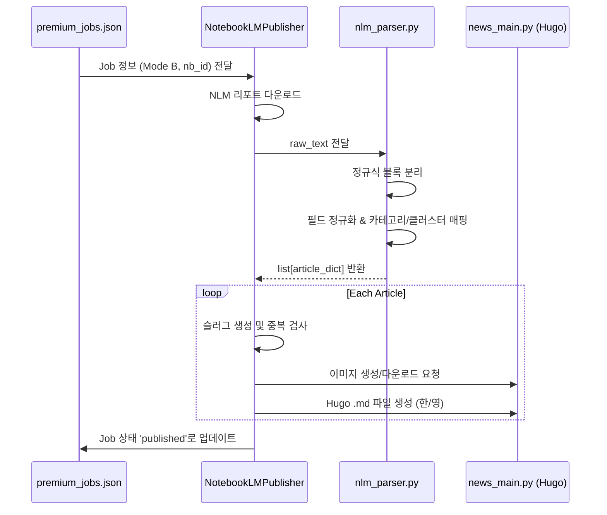

# ⚙️ CORE_LOGIC: 핵심 비즈니스 로직 및 알고리즘

## 1. 지능형 리포트 분리 파이프라인 (Mode B)
### [설계 의도]
NotebookLM에서 생성된 대규모 통합 리포트를 개별 기사 단위로 정밀하게 분리하여, 각 기사가 독립적인 뉴스 가치를 가질 수 있도록 자동화합니다. 단순한 텍스트 분할을 넘어, 다국어 대응 및 시각 자료(이미지) 자동 매칭을 목표로 합니다.

### [핵심 알고리즘: `nlm_parser.py`]
1. **유연한 블록 파싱 (Regex)**: 
   - `pattern = r'(?i)(?:---|\*?\s*\*\*?)?ARTICLE_START...ARTICLE_END'`를 통해 NLM이 생성할 수 있는 다양한 마크다운 변종 구분자를 모두 캡처합니다.
2. **다중 필드 매핑 (Field Normalization)**:
   - `FIELD_MAP`을 사용하여 NLM의 임의적인 필드 명칭(`Synthesis`, `KOR_TITLE` 등)을 시스템 내부 표준(`eng_content`, `kor_title`)으로 정규화합니다.
3. **지능형 폴백 (Context-Aware Fallback)**:
   - 구분자가 없을 경우 `ID: \d+` 패턴으로 분리를 시도하며, 최후의 수단으로 텍스트의 언어(한글 포함 여부)를 판별하여 제목을 자동 생성합니다.
   - [v4.9] 국문 제목이 없거나 영문과 동일할 경우, 국문 본문의 첫 문장을 분석하여 60자 이내의 지능형 제목을 자동 추출합니다.
   - [v5.0] **국문 상세 분석 헤더 충돌 방지**: 본문 내 `##` 헤더를 `###`로 자동 다운그레이드(Demotion)하여 시스템 상위 헤더와의 계층 충돌을 방지하고, 본문 시작부의 관성적 공정 타이틀을 제거하여 가공 품질을 높입니다.
   - [v5.2] **엄격한 언어 매핑 및 복구 마커**: 영문 기사 생성 시 영문 필드가 누락될 경우 국문 데이터를 그대로 복사하는 대신, `Recovery:` 접두사를 붙여 격리하고 본문을 비워둠으로써 영문 사이트의 한글 노출을 방지합니다.

### [실행 순서 (Sequence)]

## 2. 슬러그 생성 및 중복 방지 전략
### [알고리즘: `_publish_single_article`]
1. **Sanitization**: `sanitize_slug`를 통해 특수문자 제거 및 영문 소문자화.
2. **Hybrid Logic**: 
   - 영문 제목이 있는 경우 이를 최우선 사용.
   - 영문 제목이 없거나 한글 제목만 있어 슬러그가 비어버릴 경우 `premium-{category}-{article_id}`로 자동 변환하여 **숫자형 파일명 방지**.
3. **Collision Avoidance**: 발행 전 `is_already_published`를 통해 물리적 파일 존재 여부를 체크하여 중복 발행을 원천 차단합니다.

## 3. 대분류(Cluster) 정규화 시스템
### [매핑 원칙]
- 모든 기사는 반드시 `VALID_CLUSTERS`(`ai`, `hardware`, `insights`) 중 하나에 속해야 합니다.
- `CLUSTER_MAP`을 통해 중분류(`category`)에서 대분류를 자동 추론하며, 추론 불가 시 `ai`를 기본값으로 할당하여 시스템 안정성을 보장합니다.

## 4. 계층적 이미지 관리 전략 (Tiered Image Strategy)
### [설계 의도]
이미지 생성 병목 현상을 해결하고, API 비용 절감 및 게시 속도 향상을 위해 3단계 계층 구조를 적용합니다. 키워드 기반의 자동 학습형 이미지 라이브러리를 구축하는 것이 핵심합니다.

### [실행 알고리즘: `image_manager.py`]
1. **Tier 1: 원본 이미지 (Original)**
   - 기사 소스에 `original_image` URL이 존재하고 유효할 경우 이를 다운로드하여 최우선 사용.
2. **Tier 2: 키워드 라이브러리 (Library Match)**
   - 기사의 키워드(KOR/ENG)와 클러스터를 분석하여 `static/images/defaults/{cluster}/{keyword}.jpg` 파일이 존재하는지 확인.
   - 이미 검증된 고품질 이미지를 즉시 반환하여 API 호출을 생략.
3. **Tier 3: API 생성 및 자동 캐싱 (Generate & Cache)**
   - 위 두 단계가 실패할 경우 Pollinations AI API를 통해 이미지를 생성.
   - 생성된 이미지를 해당 기사에 적용함과 동시에, **주요 키워드 명칭으로 라이브러리에 자동 저장**하여 다음번 동일 키워드 기사에서 활용.
4. **Fallback (Tier 4)**: 모든 단계 실패 시 클러스터별 기본 폴백 이미지 사용.
   - [v4.7 패치] 실제 서버에 존재하는 `/images/fallbacks/` 내의 유효 파일명(`market-trend.jpg`, `hardware.jpg` 등)으로 매핑을 현행화하여 이미지 누락(Broken 이미지)을 원천 차단함.
5. **Path Stability (v3.0)**: 
   - 모든 이미지 생성 및 검색 기준을 `automation/static`이 아닌 **프로젝트 루트 `/static`**으로 일원화하여, 배포(Git Push) 시 이미지가 누락되는 문제를 해결하였습니다.

## 5. 예외 처리 및 보안 전략
- **Windows Encoding**: `cp949` 환경에서의 `UnicodeEncodeError` 방지를 위해 특수문자가 포함될 수 있는 디버그 출력 시 인코딩 예외 처리를 수행합니다.
- **Throttling**: 모든 AI API 호출 시 **10초 강제 대기**를 적용하여 무료 티어 안전성과 실행 효율의 균형을 맞춥니다.
- **Data Integrity**: 모든 기사 데이터는 `automation/cache/`에 영구 보존되어 필요 시 AI 호출 없이 재발행이 가능합니다.

## 6. 하이브리드 고품질 미러링 파이프라인 (Ironclad Protocol v1.1)
### [설계 의도]
Premium(NLM) 파이프라인의 분석 깊이를 Legacy(API) 파이프라인에서도 구현하기 위해 2단계 AI 추론 방식을 도입합니다. 한/영 기사의 정보를 1:1로 일치시켜 전 세계 독자에게 동일한 품질의 인사이트를 제공하는 것이 핵심입니다.

### [실행 알고리즘: `ai_news_editor.py`]
1. **Pass 1: 고수준 영문 분석 (Analytical Synthesis)**
   - RSS 수집된 원문 데이터를 바탕으로 Bloomberg/Reuters 스타일의 심층 영문 리포트(`EN_JSON_SCHEMA`)를 생성합니다.
   - 이때 기술적 사양, 비즈니스 리스크, 시장 임팩트를 우선적으로 도출합니다.
2. **Pass 2: 국문 미러링 현지화 (Mirroring Localization)**
   - 생성된 영문 리포트를 입력값으로 받아, 의미와 구조가 완벽히 대칭되는 국문 기사(`KO_JSON_SCHEMA`)를 생성합니다.
   - 용어 사전(GLOSSARY)을 적용하여 전문 용어의 번역 일관성을 확보합니다.
3. **표준 헤더 및 포맷팅 (Standard Rendering)**
   - 국문 기사 헤더를 **'상세 분석'**과 **'시사점'**으로 통일하여 전문성을 강화합니다.
   - 소제목(`###`)을 인용구 스타일(`> `)로 변환하고, 본문 내 중복 이미지를 제거하여 가독성을 극대화합니다.

## 7. 시스템 안정성 및 Throttling 정책
- **API 보호 로직**: 무료 티어 API(Gemini, Groq 등)의 할당량 보호 및 안정성 확보를 위해 **모든 요청 간 10초 강제 대기(Throttling)**를 적용합니다. (`AIWriter._wait_for_quota`)
- **멀티 모델 폴백**: 주력 모델인 `gemini-3.1-flash-lite-preview` 부하 발생 시, `gemma-3`, `llama-3.3` 등 타 엔진으로 즉시 자동 전환되어 파이프라인 중단을 방지합니다.

## 9. IndexNow 인증 및 네이버 통합 (v1.3)
### [설계 의도]
Bing 및 Naver 등 다양한 검색 엔진의 인증 방식을 통합하고, 특히 도메인별 소유권 증명이 엄격한 네이버 Search Advisor의 요구사항을 충족하기 위해 멀티 키 매핑 로직을 도입합니다.

### [핵심 로직: `indexnow_service.py`]
1. **멀티 키 도메인 매핑 (Multi-Key Mapping)**:
   - 네이버 가이드에 따라 "도메인별 개별 키" 사용 원칙을 준수합니다.
   - `INDEXNOW_KEY_BING`, `INDEXNOW_KEY_NAVER` 등 환경변수를 통해 엔진별 고유 키를 로드하여 각 엔드포인트에 최적화된 페이로드를 전송합니다.
2. **`keyLocation` 최적화**: 
   - 키 파일이 루트(static)에 배치되도록 하여 `keyLocation` 명시 시 발생할 수 있는 URL 형식 충돌을 방지합니다.
3. **헤더 강화 (User-Agent)**: 
   - 표준 `User-Agent`를 추가하여 검색 엔진의 보안 필터링을 안정적으로 통과합니다.
4. **연동 검증**: 
   - 배포 직후 로컬에서 Naver API를 호출하여 **Status 200**을 확인하는 프로세스를 거쳐 실시간 연동을 보장합니다.

## 10. 로컬-원격 자동 동기화 (Git Sync)
### [설계 의도]
로컬에서 생성된 Premium 기사가 즉시 라이브 사이트에 반영되도록 배포 공정을 자동화합니다.

### [실행 알고리즘: `nlm_orchestrator.py`]
1. **Atomic Commit**: 발행된 기사 묶음을 하나의 커밋 단위(`chore: premium news update...`)로 관리합니다.
2. **Rebase & Push**: 원격 저장소의 변경 사항을 `pull --rebase`로 먼저 통합한 후 `push`하여 충돌을 방지합니다.
3. **Sequence 제어**: 반드시 **Git Push(배포)가 성공한 후에 IndexNow를 호출**하여, 검색 엔진 크롤러가 방문했을 때 404 에러를 마주하지 않도록 보장합니다.

## 11. 의존성 관계
- `nlm_orchestrator.py` -> `git_sync`, `notify_indexnow` (최종 배포 의존)
- `notebooklm_publisher.py` -> `nlm_parser.py` (파싱 로직 의존)
- `news_main.py` -> `ai_news_editor.py` (Legacy 분석 로직 의존)
- `news_main.py` -> `image_manager.py` (Tiered Image Strategy 의존)

## 12. 클라우드 자동화 및 Stay-alive 전략 (Ubuntu)
### [설계 의도]
로컬 PC의 의존성을 제거하고 24/7 무중단 운영을 위해 Ubuntu(Oracle Cloud) 환경으로 이전하며, NLM의 세션 만료 문제를 자동화로 해결합니다.

### [핵심 로직]
1. **세션 승계**: 로컬 PC의 `.notebooklm-mcp-cli` 인증 데이터를 서버로 복사하여 초기 브라우저 인증 과정을 생략합니다.
2. **세션 연장 (Stay-alive)**: `cron`을 활용하여 매 1시간마다 `nlm studio status` 명령을 실행, 구글 세션 활동을 유지하여 만료를 방지합니다.
3. **환경 최적화**: 서버의 Headless 환경에 맞춰 `Hugo` 빌드 및 `Git` 푸시 과정을 비대화형(Non-interactive)으로 구성합니다.
4. **환경 변수 로딩**: [v5.3 추가] `crontab` 등 최소화된 쉘 환경에서도 API 키를 원활히 불러오기 위해, 모든 오케스트레이터 및 상위 실행 스크립트 상단에서 `load_dotenv()`를 호출하여 `.env` 파일의 변수를 명시적으로 주입합니다.

## 13. 단계별 보고 및 상태 알림 시스템 (Telegram Reporting)
### [설계 의도]
24/7 자동화 환경에서 파이프라인의 진행 상황과 중단 여부를 사용자가 즉시 인지할 수 있도록 실시간 피드백 루프를 구축합니다.

### [핵심 로직]
1. **이벤트 기반 알림 (Event-Driven Notifications)**:
   - **Start**: 파이프라인 시작 시 모드, 소스, 제한값 보고.
   - **Step 1&2 Done**: 뉴스 수집 및 NLM 리포트 트리거 완료 시 보고.
   - **Stopped (Empty Items)**: [v2.2 추가] 새로운 기사가 없어 Phase 1에서 중단될 경우 명시적 보고.
   - **Finished**: 게시 및 인덱싱 완료 후 최종 기사 수 및 소요 시간 보고.
   - **Crashed**: 예외 발생 시 트레이스백 요약을 포함한 긴급 보고.
2. **트렁케이션 제어 (Truncation Policy) [v4.9]**:
   - 요약문 자동 생성 시 정보 누락 방지를 위해 임계값을 기존 200자에서 600자로 대폭 완화하여 심층 분석의 맥락을 보존합니다.
3. **로그 가시성 (Log Transparency)**:
   - 텔레그램 발송 성공 시 로그에 메시지 첫 줄(Snippet)을 함께 출력하여, 로그 파일만으로도 어떤 단계의 알림이 전송되었는지 즉시 파악 가능하게 합니다.
4. **양방향 지침 브릿지 (Telegram Bridge) [v5.0]**:
   - `fetch_latest_reply`를 통해 사용자의 텔레그램 답장을 감지하고 `.gravityBrain/TELEGRAM_INBOX.md`에 저장하여 에이지언트의 원격 작업 지침함으로 활용합니다. (현재는 단방향 알림을 기본으로 함)

### [의존 모듈]
- `common_utils.py`, `telegram_bridge.py` -> 텔레그램 연동 로직
- `nlm_orchestrator.py`, `notify.py` -> 전체 공정 관리 및 알림 트리거링
- `indexnow_service.py` -> `google_indexing_service.py` (인덱싱 통합 의존)

## 14. Google Indexing API 연동 및 보안 (v1.4)
### [설계 의도]
Bing/Naver의 IndexNow 방식과 달리, OAuth2 기반의 서비스 계정 인증을 요구하는 Google Indexing API를 통합하여 구글 검색 결과에 최신 뉴스가 즉시 반영되도록 합니다.

### [핵심 로직]
1. **서비스 계정 기반 인증 (Service Account Auth)**:
   - Google Cloud Console에서 생성된 서비스 계정의 JSON 키를 사용하여 `google.oauth2.service_account`를 통한 인증을 수행합니다.
   - `indexing.v3` 서비스를 빌드하여 `urlNotifications().publish()` 메서드를 호출합니다.
2. **통합 호출 인터페이스**:
   - `indexnow_service.py`를 모든 검색 엔진 인덱싱의 통합 허브로 설정하였습니다.
   - `notify_indexnow(urls)` 함수가 호출될 때 내부적으로 `google_indexing_service.py`를 연동 호출하여 원스톱 인덱싱을 보장합니다.
3. **보안 및 키 관리 (Key Protection)**:
   - 민감한 JSON 키 파일은 `automation/keys/` 폴더에 별도로 보관하며, 해당 폴더는 `.gitignore`에 등록하여 GitHub 저장소에 노출되지 않도록 철저히 격리합니다.
   - 클라우드 배포 시에는 수동으로 해당 경로에 키를 배치하는 **'Manual Key Handover'** 프로토콜을 따릅니다.

## 15. 스마트 이월(Backlog) 시스템 및 데이터 지속성 (v5.4)
### [설계 의도]
NLM의 출력 토큰 한계(Response Token Limit)를 준수하기 위해 발행 한도를 제한하되, 품질이 우수한 기사가 RSS 피드에서 밀려나 유실되는 것을 방지하기 위해 상주형 대기열을 구축합니다.

### [핵심 알고리즘: `HarvesterV3.fetch_all`]
1. **백로그 로드 (Prioritization)**: 
   - 실행 시 `automation/cache/backlog.json`에서 이전 회차에 이월된 기사 데이터를 가장 먼저 불러옵니다.
2. **RSS 통합 및 중복 제거**: 
   - 새로 수집된 RSS 기사 중 백로그에 없는 기사들만 골라 하나의 처리 풀(Pool)을 형성합니다.
3. **품질 기반 선별 (Dual-Pass Filter)**: 
   - LLM 점수가 기준치를 넘는 '생존 기사'들을 확정합니다.
4. **한도 기반 이월 (Deferral Logic)**: 
   - 생존 기사 중 상위 8개(설정값)만 이번 배치에서 발행합니다.
   - **8개를 초과하는 나머지 고품질 기사들**은 `backlog.json`에 다시 저장하여 다음 배치에서 최우선 순위를 갖게 합니다.
5. **신선도 유지 (Expiration Policy)**:
   - 기사의 발행 시간(`publishedAt`)이 **48시간을 초고**한 경우, 정보 가치가 낮아진 것으로 판단하여 백로그에서 자동으로 제외합니다.

### [데이터 안정성 정책]
- **Atomic Save**: 백로그 데이터는 매 회차 필터링 완료 직후 즉시 파일로 기록됩니다.
- **Queue Limit**: 백로그 파일의 무한 비대를 방지하기 위해 최대 저장 기사 수를 50건으로 제한합니다.

## 17. 실시간 영문 복구 및 AI 번역 안정화 (v6.1)
### [설계 의도]
NLM의 영문 본문 출력 누락(Token Limit 또는 분석 실패) 시 '제목만 있는 영문 기사'가 나가는 것을 방지하기 위해, 발행 단계에서 AI를 이용한 실시간 번역 보충 시스템을 운영합니다.

### [핵심 로직: `notebooklm_publisher.py`]
1. **임계값 검사**: 영문 본문(`eng_content`)이 100자 미만일 경우 '누락'으로 판정합니다.
2. **AI 오케스트레이터 (`AIWriter`) 연동**: 
   - `gemini-2.0-flash` 모델을 최우선으로 사용하여 국문을 영문으로 정밀 번역합니다.
   - **다중 모델 폴백**: Google Native 429 에러 발생 시 OpenRouter API(`google/gemini-2.0-flash-001`)로 자동 전환되어 파이프라인 중단을 방지합니다.
3. **최후의 방어선 (Fallback)**: 모든 AI 호출이 실패할 경우, 빈 페이지 대신 국문 본문을 영문 페이지에 노출시켜 서비스 가독성을 유지합니다.

### 4.4 [V6.4] 스마트 분할 발행 및 품질 보전 (Smart Split & Job Merge)
- **분할 임계값 (Threshold)**: 카테고리당 기사 **5개 초과 시** 자동으로 Job 분할 (Part 1, Part 2...). 
- **Job 병합 (Merge)**: `premium_jobs.json` 저장 시 기존 대기열을 보존하며 `update` 수행. 특정 카테고리 기만 먼저 발행해도 다른 대기 중인 카테고리가 삭제되는 문제를 방지합니다.
- **유연한 파싱 (Delimiters)**: 덤프 파일의 구분선(`---`)과 파서의 구분자를 동기화하여 누락 없는 기사 추출.

### [핵심 알고리즘: `notebooklm_prep.py`]
1. **임계값 기반 분할**: 카테고리당 수집된 기사가 8개를 초과하면 `_split_articles_into_batches` 함수가 가동됩니다.
2. **Job 분리**: 
   - 기사를 `Part 1`, `Part 2` 등으로 나누어 별도의 마크다운 소스 파일을 생성합니다.
   - 각 소스마다 독립된 NLM 노트북과 리포트를 생성하여 NLM이 처리해야 할 출력 텍스트 양을 최적화합니다.
3. **독립 제목 및 수렴**: 각 분할된 Job은 게시 시점에서 독립된 포스트로 처리되어 전체 기사가 누락 없이 발행됩니다.

## 19. 고품질 원본 이미지 보전 전략 (Bypass Bot Detection) (v6.2)
### [설계 의도]
언론사 서버의 봇 차단 로직을 우회하여 AI 생성 이미지보다 고화질의 원본 썸네일을 최대한 확보하도록 다운로드 로직을 고도화합니다.

### [핵심 로직: `image_manager.py`]
1. **브라우저 가상 헤더 (Header Injection)**: 
   - `Referer`, `Accept-Language`, `Sec-Fetch-Dest` 등 실제 크롬 브라우저와 동일한 헤더 셋을 주입하여 언론사 방화벽을 통과합니다.
2. **MIME 및 무결성 검증**: 
   - `Content-Type`을 검사하여 실제 이미지 파일인지 확인합니다.
   - 파일 크기가 2KB 미만인 경우 깨진 파일(또는 1x1 픽셀)로 간주하여 AI 생성(Tier 3)으로 즉시 폴백을 트리거합니다.

## 20. 의존성 관계 업데이트
- `notebooklm_prep.py` -> `_split_articles_into_batches` (출력 안정성 의존)
- `notebooklm_publisher.py` -> `AIWriter.translate_to_english` (데이터 무결성 의존)
- `image_manager.py` -> `requests.headers` (이미지 원본 보전 의존)
