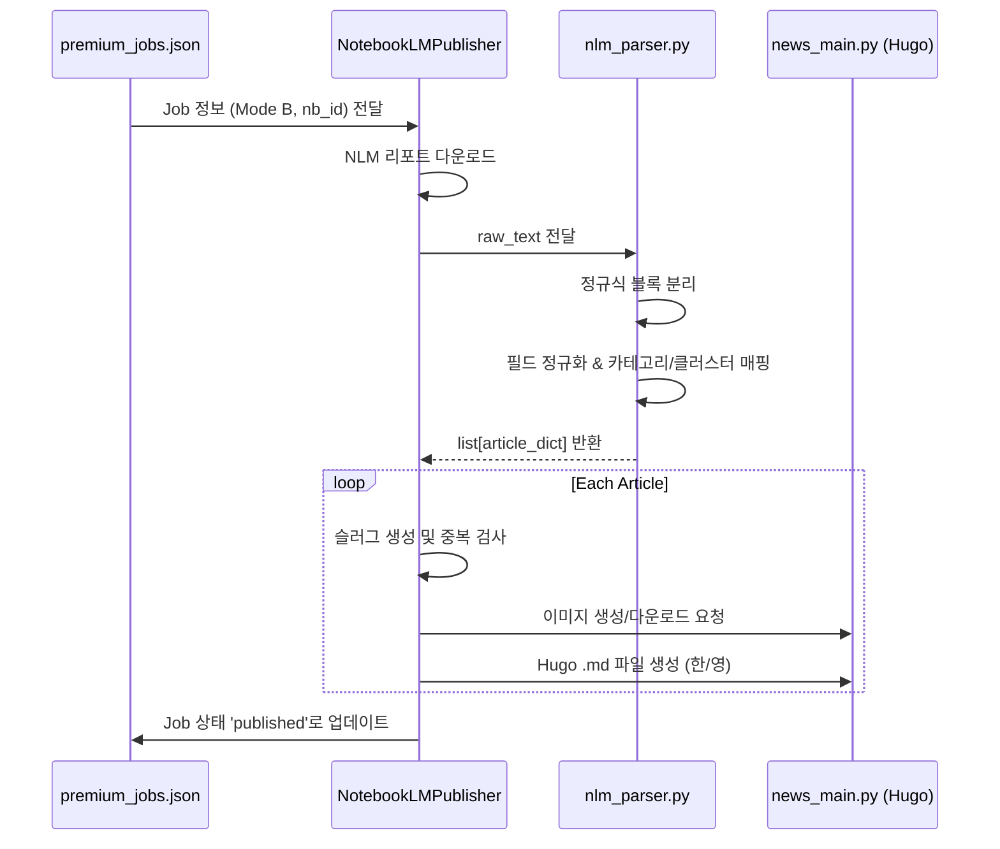

# ⚙️ CORE_LOGIC: 핵심 비즈니스 로직 및 알고리즘

## 1. 지능형 리포트 분리 파이프라인 (Mode B)
### [설계 의도]
NotebookLM에서 생성된 대규모 통합 리포트를 개별 기사 단위로 정밀하게 분리하여, 각 기사가 독립적인 뉴스 가치를 가질 수 있도록 자동화합니다. 단순한 텍스트 분할을 넘어, 다국어 대응 및 시각 자료(이미지) 자동 매칭을 목표로 합니다.

### [핵심 알고리즘: `nlm_parser.py`]
1. **유연한 블록 파싱 (Regex)**: 
   - `pattern = r'(?i)(?:---|\*?\s*\*\*?)?ARTICLE_START...ARTICLE_END'`를 통해 NLM이 생성할 수 있는 다양한 마크다운 변종 구분자를 모두 캡처합니다.
2. **다중 필드 매핑 (Field Normalization)**:
   - `FIELD_MAP`을 사용하여 NLM의 임의적인 필드 명칭(`Synthesis`, `KOR_TITLE` 등)을 시스템 내부 표준(`eng_content`, `kor_title`)으로 정규화합니다.
3. **지능형 폴백 (Context-Aware Fallback)**:
   - 구분자가 없을 경우 `ID: \d+` 패턴으로 분리를 시도하며, 최후의 수단으로 텍스트의 언어(한글 포함 여부)를 판별하여 제목을 자동 생성합니다.

### [실행 순서 (Sequence)]

## 2. 슬러그 생성 및 중복 방지 전략
### [알고리즘: `_publish_single_article`]
1. **Sanitization**: `sanitize_slug`를 통해 특수문자 제거 및 영문 소문자화.
2. **Hybrid Logic**: 
   - 영문 제목이 있는 경우 이를 최우선 사용.
   - 영문 제목이 없거나 한글 제목만 있어 슬러그가 비어버릴 경우 `premium-{category}-{article_id}`로 자동 변환하여 **숫자형 파일명 방지**.
3. **Collision Avoidance**: 발행 전 `is_already_published`를 통해 물리적 파일 존재 여부를 체크하여 중복 발행을 원천 차단합니다.

## 3. 대분류(Cluster) 정규화 시스템
### [매핑 원칙]
- 모든 기사는 반드시 `VALID_CLUSTERS`(`ai`, `hardware`, `insights`) 중 하나에 속해야 합니다.
- `CLUSTER_MAP`을 통해 중분류(`category`)에서 대분류를 자동 추론하며, 추론 불가 시 `ai`를 기본값으로 할당하여 시스템 안정성을 보장합니다.

## 4. 계층적 이미지 관리 전략 (Tiered Image Strategy)
### [설계 의도]
이미지 생성 병목 현상을 해결하고, API 비용 절감 및 게시 속도 향상을 위해 3단계 계층 구조를 적용합니다. 키워드 기반의 자동 학습형 이미지 라이브러리를 구축하는 것이 핵심입니다.

### [실행 알고리즘: `image_manager.py`]
1. **Tier 1: 원본 이미지 (Original)**
   - 기사 소스에 `original_image` URL이 존재하고 유효할 경우 이를 다운로드하여 최우선 사용.
2. **Tier 2: 키워드 라이브러리 (Library Match)**
   - 기사의 키워드(KOR/ENG)와 클러스터를 분석하여 `static/images/defaults/{cluster}/{keyword}.jpg` 파일이 존재하는지 확인.
   - 이미 검증된 고품질 이미지를 즉시 반환하여 API 호출을 생략.
3. **Tier 3: API 생성 및 자동 캐싱 (Generate & Cache)**
   - 위 두 단계가 실패할 경우 Pollinations AI API를 통해 이미지를 생성.
   - 생성된 이미지를 해당 기사에 적용함과 동시에, **주요 키워드 명칭으로 라이브러리에 자동 저장**하여 다음번 동일 키워드 기사에서 활용.
4. **Fallback**: 모든 단계 실패 시 클러스터별 기본 폴백 이미지 사용.

## 5. 예외 처리 및 보안 전략
- **Windows Encoding**: `cp949` 환경에서의 `UnicodeEncodeError` 방지를 위해 특수문자가 포함될 수 있는 디버그 출력 시 인코딩 예외 처리를 수행합니다.
- **Throttling**: AI 이미지 생성 및 API 호출 시 5~10초의 간격을 두어 Throttling 리스크를 최소화합니다.
- **Data Integrity**: NLM 리포트 원문을 `scratch/premium_reports/`에 보존하여 파싱 실패 시 수동 복구가 가능하도록 설계되었습니다.

## 5. 의존성 관계
- `notebooklm_publisher.py` -> `nlm_parser.py` (파싱 로직 의존)
- `notebooklm_publisher.py` -> `news_main.py` (Hugo 생성 및 이미지 로직 의존)
- `news_main.py` -> `ai_writer.py` (이미지 생성 API 의존)
