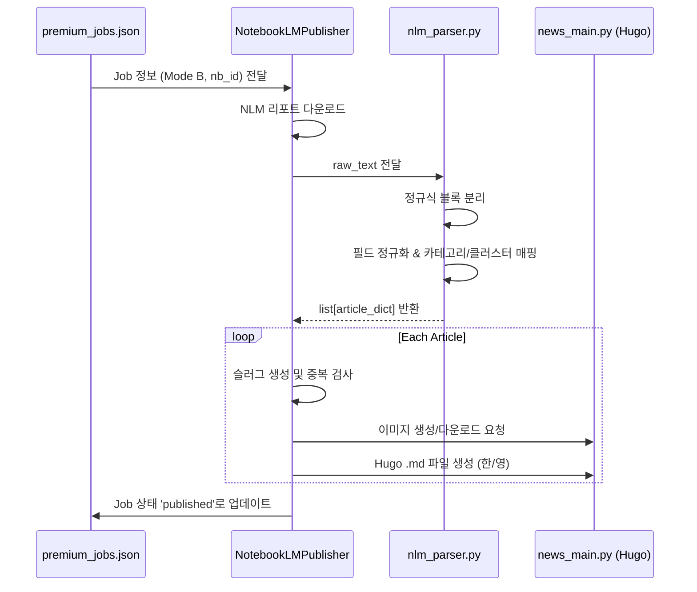

# ⚙️ CORE_LOGIC: 핵심 비즈니스 로직 및 알고리즘

## 1. 지능형 리포트 분리 파이프라인 (Mode B)
### [설계 의도]
NotebookLM에서 생성된 대규모 통합 리포트를 개별 기사 단위로 정밀하게 분리하여, 각 기사가 독립적인 뉴스 가치를 가질 수 있도록 자동화합니다. 단순한 텍스트 분할을 넘어, 다국어 대응 및 시각 자료(이미지) 자동 매칭을 목표로 합니다.

### [핵심 알고리즘: `nlm_parser.py`]
1. **유연한 블록 파싱 (Regex)**: 
   - `pattern = r'(?i)(?:---|\*?\s*\*\*?)?ARTICLE_START...ARTICLE_END'`를 통해 NLM이 생성할 수 있는 다양한 마크다운 변종 구분자를 모두 캡처합니다.
2. **다중 필드 매핑 (Field Normalization)**:
   - `FIELD_MAP`을 사용하여 NLM의 임의적인 필드 명칭(`Synthesis`, `KOR_TITLE` 등)을 시스템 내부 표준(`eng_content`, `kor_title`)으로 정규화합니다.
3. **지능형 폴백 (Context-Aware Fallback)**:
   - 구분자가 없을 경우 `ID: \d+` 패턴으로 분리를 시도하며, 최후의 수단으로 텍스트의 언어(한글 포함 여부)를 판별하여 제목을 자동 생성합니다.

### [실행 순서 (Sequence)]

## 2. 슬러그 생성 및 중복 방지 전략
### [알고리즘: `_publish_single_article`]
1. **Sanitization**: `sanitize_slug`를 통해 특수문자 제거 및 영문 소문자화.
2. **Hybrid Logic**: 
   - 영문 제목이 있는 경우 이를 최우선 사용.
   - 영문 제목이 없거나 한글 제목만 있어 슬러그가 비어버릴 경우 `premium-{category}-{article_id}`로 자동 변환하여 **숫자형 파일명 방지**.
3. **Collision Avoidance**: 발행 전 `is_already_published`를 통해 물리적 파일 존재 여부를 체크하여 중복 발행을 원천 차단합니다.

## 3. 대분류(Cluster) 정규화 시스템
### [매핑 원칙]
- 모든 기사는 반드시 `VALID_CLUSTERS`(`ai`, `hardware`, `insights`) 중 하나에 속해야 합니다.
- `CLUSTER_MAP`을 통해 중분류(`category`)에서 대분류를 자동 추론하며, 추론 불가 시 `ai`를 기본값으로 할당하여 시스템 안정성을 보장합니다.

## 4. 계층적 이미지 관리 전략 (Tiered Image Strategy)
### [설계 의도]
이미지 생성 병목 현상을 해결하고, API 비용 절감 및 게시 속도 향상을 위해 3단계 계층 구조를 적용합니다. 키워드 기반의 자동 학습형 이미지 라이브러리를 구축하는 것이 핵심입니다.

### [실행 알고리즘: `image_manager.py`]
1. **Tier 1: 원본 이미지 (Original)**
   - 기사 소스에 `original_image` URL이 존재하고 유효할 경우 이를 다운로드하여 최우선 사용.
2. **Tier 2: 키워드 라이브러리 (Library Match)**
   - 기사의 키워드(KOR/ENG)와 클러스터를 분석하여 `static/images/defaults/{cluster}/{keyword}.jpg` 파일이 존재하는지 확인.
   - 이미 검증된 고품질 이미지를 즉시 반환하여 API 호출을 생략.
3. **Tier 3: API 생성 및 자동 캐싱 (Generate & Cache)**
   - 위 두 단계가 실패할 경우 Pollinations AI API를 통해 이미지를 생성.
   - 생성된 이미지를 해당 기사에 적용함과 동시에, **주요 키워드 명칭으로 라이브러리에 자동 저장**하여 다음번 동일 키워드 기사에서 활용.
4. **Fallback**: 모든 단계 실패 시 클러스터별 기본 폴백 이미지 사용.

## 5. 예외 처리 및 보안 전략
- **Windows Encoding**: `cp949` 환경에서의 `UnicodeEncodeError` 방지를 위해 특수문자가 포함될 수 있는 디버그 출력 시 인코딩 예외 처리를 수행합니다.
- **Throttling**: 모든 AI API 호출 시 **10초 강제 대기**를 적용하여 무료 티어 안전성과 실행 효율의 균형을 맞춥니다.
- **Data Integrity**: 모든 기사 데이터는 `automation/cache/`에 영구 보존되어 필요 시 AI 호출 없이 재발행이 가능합니다.

## 6. 하이브리드 고품질 미러링 파이프라인 (Ironclad Protocol v1.1)
### [설계 의도]
Premium(NLM) 파이프라인의 분석 깊이를 Legacy(API) 파이프라인에서도 구현하기 위해 2단계 AI 추론 방식을 도입합니다. 한/영 기사의 정보를 1:1로 일치시켜 전 세계 독자에게 동일한 품질의 인사이트를 제공하는 것이 핵심입니다.

### [실행 알고리즘: `ai_news_editor.py`]
1. **Pass 1: 고수준 영문 분석 (Analytical Synthesis)**
   - RSS 수집된 원문 데이터를 바탕으로 Bloomberg/Reuters 스타일의 심층 영문 리포트(`EN_JSON_SCHEMA`)를 생성합니다.
   - 이때 기술적 사양, 비즈니스 리스크, 시장 임팩트를 우선적으로 도출합니다.
2. **Pass 2: 국문 미러링 현지화 (Mirroring Localization)**
   - 생성된 영문 리포트를 입력값으로 받아, 의미와 구조가 완벽히 대칭되는 국문 기사(`KO_JSON_SCHEMA`)를 생성합니다.
   - 용어 사전(GLOSSARY)을 적용하여 전문 용어의 번역 일관성을 확보합니다.
3. **표준 헤더 및 포맷팅 (Standard Rendering)**
   - 국문 기사 헤더를 **'상세 분석'**과 **'시사점'**으로 통일하여 전문성을 강화합니다.
   - 소제목(`###`)을 인용구 스타일(`> `)로 변환하고, 본문 내 중복 이미지를 제거하여 가독성을 극대화합니다.

## 7. 시스템 안정성 및 Throttling 정책
- **API 보호 로직**: 무료 티어 API(Gemini, Groq 등)의 할당량 보호 및 안정성 확보를 위해 **모든 요청 간 10초 강제 대기(Throttling)**를 적용합니다. (`AIWriter._wait_for_quota`)
- **멀티 모델 폴백**: 주력 모델인 `gemini-3.1-flash-lite-preview` 부하 발생 시, `gemma-3`, `llama-3.3` 등 타 엔진으로 즉시 자동 전환되어 파이프라인 중단을 방지합니다.

## 9. IndexNow 인증 최적화 (v1.2)
### [설계 의도]
Bing 및 타 검색 엔진 API의 403(Forbidden) 에러를 방지하고, 도메인 소유권 인증을 가장 안정적으로 처리하기 위해 페이로드를 최적화합니다.

### [핵심 로직: `indexnow_service.py`]
1. **`keyLocation` 제거**: IndexNow 프로토콜상 키 파일이 루트에 존재할 경우 `keyLocation`은 선택 사항입니다. 명시적으로 전달할 때 발생하는 URL 형식 충돌을 방지하기 위해 이를 제거하고 Bing이 루트에서 직접 찾도록 유도합니다.
2. **헤더 강화 (User-Agent)**: 단순 API 호출이 아닌 실제 브라우저 요청처럼 보이도록 표준 `User-Agent`를 추가하여 보안 필터링을 통과합니다.
3. **통합 엔드포인트**: `api.indexnow.org`를 포함한 다중 엔드포인트 호출을 통해 전파 속도를 극대화합니다.

## 10. 로컬-원격 자동 동기화 (Git Sync)
### [설계 의도]
로컬에서 생성된 Premium 기사가 즉시 라이브 사이트에 반영되도록 배포 공정을 자동화합니다.

### [실행 알고리즘: `nlm_orchestrator.py`]
1. **Atomic Commit**: 발행된 기사 묶음을 하나의 커밋 단위(`chore: premium news update...`)로 관리합니다.
2. **Rebase & Push**: 원격 저장소의 변경 사항을 `pull --rebase`로 먼저 통합한 후 `push`하여 충돌을 방지합니다.
3. **Sequence 제어**: 반드시 **Git Push(배포)가 성공한 후에 IndexNow를 호출**하여, 검색 엔진 크롤러가 방문했을 때 404 에러를 마주하지 않도록 보장합니다.

## 11. 의존성 관계
- `nlm_orchestrator.py` -> `git_sync`, `notify_indexnow` (최종 배포 의존)
- `notebooklm_publisher.py` -> `nlm_parser.py` (파싱 로직 의존)
- `news_main.py` -> `ai_news_editor.py` (Legacy 분석 로직 의존)
- `news_main.py` -> `image_manager.py` (Tiered Image Strategy 의존)

