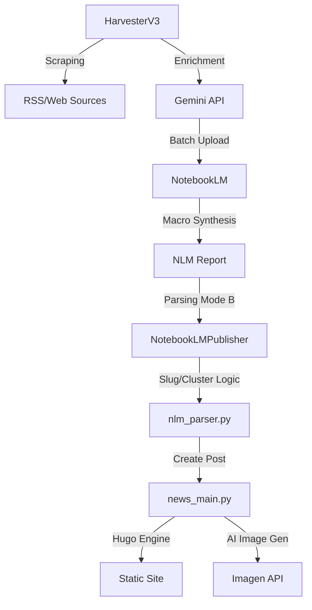

# 🗺️ SYSTEM_MAP: 뉴스 자동화 아키텍처

## 🏗️ 전체 구조

## 📂 주요 모듈 및 역할
- **`automation/news_main.py`**: 휴고 포스트 생성 및 전체 파이프라인 총괄 (Production Core)
- **`automation/notebooklm_publisher.py`**: NLM 리포트를 가져와서 쪼개고 배포하는 오케스트레이터
- **`automation/image_manager.py`**: Tiered Image Strategy (원본 -> 라이브러리 -> 생성) 담당
- **`automation/nlm_parser.py`**: NLM 마크다운 분석 및 기사 객체 변환
- **`automation/premium_jobs.json`**: 진행 중인 프리미엄 작업의 상태 및 모드 관리

## 🏷️ 대분류 및 태그 체계 (Standard v2.0)
- **Clusters (대분류)**: `ai`, `hardware`, `insights`
- **Categories (중분류)**: `models`, `apps`, `chips`, `high-end`, `analysis`, `guide`
