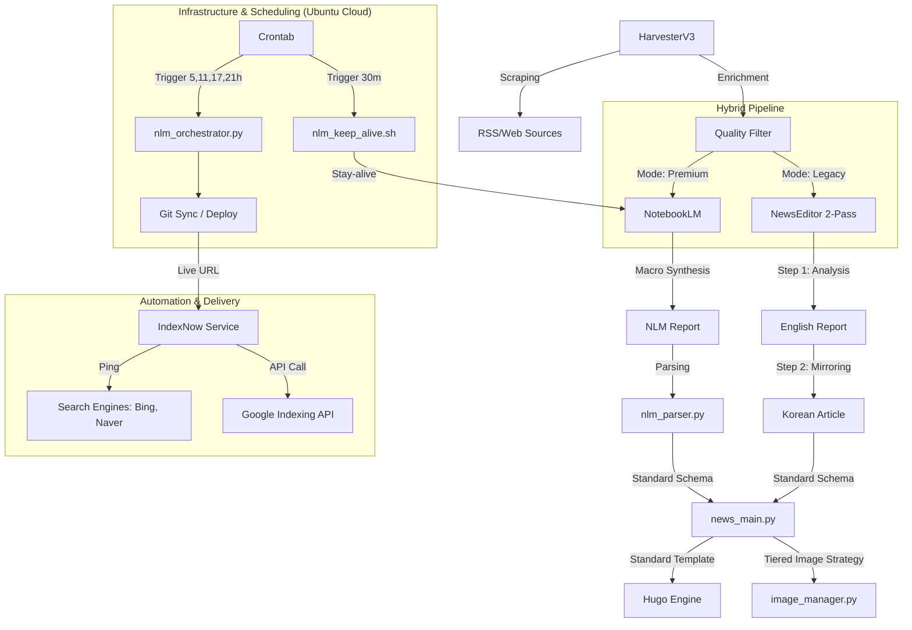

# 🗺️ SYSTEM_MAP: 뉴스 자동화 아키텍처

## 🏗️ 전체 구조

## 📂 주요 모듈 및 역할
- **`automation/harvester_v3.py`**: RSS 수집, 고품질 필터링 및 **스마트 이월(Backlog)** 핵심 모듈 [v5.4]
- **`automation/news_main.py`**: 표준 템플릿 엔진 및 전체 파이프라인 총괄 (언어 통합 처리)
- **`automation/nlm_orchestrator.py`**: Premium(NLM) 전체 공정 오케스트레이터. [v2.2] 크론탭 환경 대응을 위한 `.env` 자동 로드 기능 포함.
- **`automation/notebooklm_prep.py`**: NLM 전처리 및 **스마트 분할 발행(Smart Job Split)** 핵심 모듈. 기사가 8개를 초과할 경우 자동으로 Job을 분주하여 출력 안정성을 확보합니다. [v6.2]
- **`automation/image_manager.py`**: 프로젝트 루트 `static` 폴더를 기준으로 이미지를 통합 관리하는 Tiered Strategy 허브. [v6.4] 브라우저 가상 헤더 세트를 통한 언론사 차단 우회 및 원본 이미지 우선 보전 로직이 강화되었습니다.
- **`automation/notebooklm_publisher.py`**: NLM 리포트 파싱 및 기사 발행 유틸리티. [v6.4] 본문 누락 시 Gemini 2.0 Flash를 통한 **실시간 영문 복구(Recovery)** 로직이 포함되었습니다.
- **`automation/ai_writer.py`**: AI 텍스트 생성 및 번역 핵심 엔진. [v6.4] 다중 모델 폴백 및 초정밀 쓰로틀링(Throttling) 정책이 적용되었습니다.

## 🚀 특이사항
- **버전**: v14.1 (JSON-Native Architecture)
- **상태**: Green (정형 데이터 기반의 극강 안정성)
- **최근 주요 변경**: NotebookLM JSON 출력 강제화(v14.0), JSON-Regex 하이브리드 파싱 엔진, NLM 작업 분할 임계값 하향(T=4).
- **Real-time Recovery**: 영문 서비스의 '빈 페이지' 발생을 원천 차단하는 지능형 번역 폴백 시스템 운영.
- **Full Automation**: 수확부터 리포트 대기, 발행, Git Push(배포), IndexNow까지 단일 명령으로 처리.
- **IndexNow v1.6**: Naver/Bing Streaming(GET) 방식에 1초 쓰로틀링(Throttling) 및 배포 실패 시에도 알림 보장 로직 추가.
- **NLM Retention (v3.0)**: 2일 이상 경과한 노후 노트북 자동 삭제 로직을 통한 저장 공간 최적화.
- **Git Sync**: 로컬에서 생성된 기사를 자동으로 GitHub에 반영하여 라이브 사이트 실시간 업데이트.

## 🏷️ 대분류 체계 (Standard v4.0)
- **Clusters (대분류)**: `ai`, `hardware`, `insights`, `markets`
- **Categories (중분류)**: [REMOVED] 내비게이션 단순화를 위해 전면 폐지 (2026-04-23)
- **UI Colors**: `hugo.toml` 내 `params.ui.badge_colors`에서 중앙 관리
