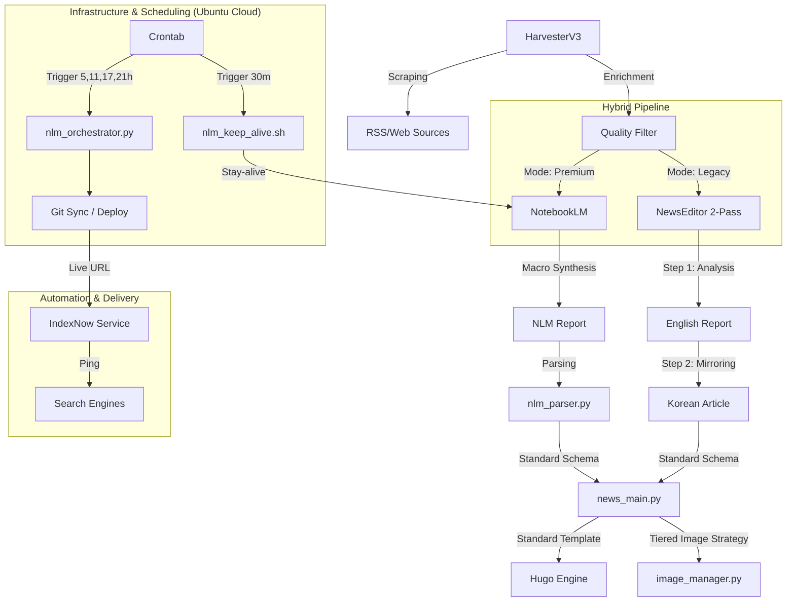

# 🗺️ SYSTEM_MAP: 뉴스 자동화 아키텍처

## 🏗️ 전체 구조

## 📂 주요 모듈 및 역할
- **`automation/news_main.py`**: 표준 템플릿 엔진 및 전체 파이프라인 총괄 (언어 통합 처리)
- **`automation/nlm_orchestrator.py`**: Premium(NLM) 전체 공정(수확->생성->배포) 오케스트레이터 [v1.7]
- **`automation/notebooklm_publisher.py`**: NLM 리포트 파싱 및 기사 발행 유틸리티
- **`automation/indexnow_service.py`**: 검색 엔진 실시간 인덱싱 요청 (Naver 멀티 키 지원)
- **`automation/nlm_keep_alive.sh`**: 1시간 주기 NLM 세션 유지(Stay-alive) 스크립트 [v2.0]
- **`automation/crontab_config.txt`**: Ubuntu 클라우드 전체 스케줄링 가이드 [v2.0]
- **`automation/reprocess_reports.py`**: 파싱 오류 또는 필드 누락 시 기존 리포트를 지능형 로직으로 재발행하는 긴급 복구 모듈 [v4.9]
- **`automation/telegram_bridge.py`**: 텔레그램 알림 송신 및 사용자 지침 수신을 처리하는 양방향 브릿지 [v5.0]
- **`automation/notify.py`**: 다양한 작업 완료 시 상태를 요약하여 보고하는 통합 알림 CLI [v5.0]
- **`automation/image_manager.py`**: 프로젝트 루트 `static` 폴더를 기준으로 이미지를 통합 관리하는 Tiered Strategy 허브 [v3.0]
  - [v4.9] 국문 제목이 없거나 영문과 동일할 경우, 국문 본문의 첫 문장을 분석하여 60자 이내의 지능형 제목을 자동 추출합니다.
  - [v5.0] **국문 상세 분석 헤더 충돌 방지**: 본문 내 `##` 헤더를 `###`로 자동 다운그레이드하여 시스템 헤더와의 계층 충돌을 방지하고, 시작부의 관성적 공정 제목을 자동 제거합니다.
  - [v4.7 패치] 실제 서버에 존재하는 `/images/fallbacks/` 내의 유효 파일명(`market-trend.jpg`, `hardware.jpg` 등)으로 매핑을 현행화하여 이미지 누락(Broken 이미지)을 원천 차단함.
  - [v3.0] 모든 이미지 생성 및 검색 기준을 `automation/static`이 아닌 **프로젝트 루트 `/static`**으로 일원화하여, 배포(Git Push) 시 이미지가 누락되는 문제를 해결하였습니다.

## 🚀 특이사항
- **Full Automation**: Premium 모드는 수확부터 리포트 대기, 발행, Git Push(배포), IndexNow까지 단일 명령으로 처리.
- **IndexNow v1.3**: Naver Search Advisor 통합 및 도메인별 개별 키(News 전용) 매핑 로직 추가.
- **Git Sync**: 로컬에서 생성된 기사를 자동으로 GitHub에 반영하여 라이브 사이트 실시간 업데이트.

## 🏷️ 대분류 및 태그 체계 (Standard v2.0)
- **Clusters (대분류)**: `ai`, `hardware`, `insights`
- **Categories (중분류)**: `models`, `apps`, `chips`, `high-end`, `analysis`, `guide`
